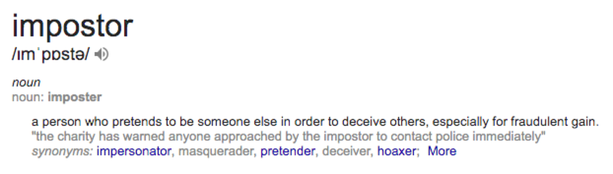

---?color=#87B6A7

@snap[north-west ubuntu-heavy]
# Overcoming imposter syndrome
@snapend


@snap[south-east fragment]
process from February til now in 
@snapend


---



Note:
- test
- two 
- three

---

## ```whoami```

@snap[fragment ubuntu left]
Eike
@snapend

@snap[fragment ubuntu left]
25
@snapend

@snap[fragment ubuntu left]
Estonia
@snapend

@snap[fragment ubuntu left]
AP in Multimedia Design and Communication in Denmark
@snapend

@snap[fragment ubuntu left]
Erasmus in Cyprus
@snapend


estonia
dk
cyprus
just AP
fail internship
agency job
always front end
more design than code...
and music. dance. theatre.

@snap[fragment]
-  AP in Multimedia Design and Communication 
@snapend

@snap[fragment]
-  agency 
@snapend

---

and now: 
python, java, js, aws
do it all
business card

---
 What worked for me:


---
What is it? How to recognise you have one?

How to do it
1. do what you can and take pride in that. take in the compliments sincerely (however small you think the thing you did is) (EX: slider)
2. talk when you have opinion
3. learn more - about things you ought to know and about things you don't
4. learn more
5. make a way to ask questions in the way that you show that you know something but not everything
6. try not to laugh when others make mistakes. i understand, it humanises them in your eyes, but puts you in worse light in their eyes.
7. communicate when blocked. 3 second rule like in dating or networking - when you see somebody you want to talk to, you need to get up and walking within 3s, otherwise it is too late. can postpone sometimes when you see the person is obviously very bizy.
8. stop comparing yourself with people above your level. (easier said than done) (EX: brendan. orchestra. )
it has a good side - setting your goals high, to go and get them, but
9. lower your levels - try to not get it perfect. aim there is long run, but able yourself to fail, convince that you should fail on first try.
10. communicate those issues  - finding out your peers have also self-doupt and they are not superhuman know-it-all robots helps a lot. EX: honest retros
11. Don't lie in your skills - it will come out. even halflie is no good (knowing the thing half-way)
12. tim ferriss self-evaluation: hungry? tired? yep, then skip the thought for later. not proper to deal with them.
13. take action - do, learn, talk, run. it helps timiding the feeling.
14. stop giving excuses for successes. own it and fake it til you make it where you want to be.
15. positive self talk. acknowledge the inner critic telling you off. shut it.
16. don;t let ego come on the way of asking questions.
17. take note of archievements

ex: couldn't speak to coworkers cause eyes were watering of thoughts that I'm not good enough and I don't know how to do it.

https://startupbros.com/21-ways-overcome-impostor-syndrome/

- fear of being discovered
- great team helps a lot
- how to do it, examples of how I did it
- communication, asking
- no lies about your skills, even if you are not sure if it is a lie or not
- lrean, learn, learn
-

---

learning process. how to becom from front end to fullstack
- learn, take on tasks that wont be able to complete
- mindset in cc
- helpful coworkers
how team is working so well that we don't need cto
- standups
- weekly sprints, planning on fridays
-  retros
-


---
This is [placeholder](www.neti.ee) image


---
## Customise

@css[classname](use css custom styles)


---

points to take from here:
you are not alone
shut up and action